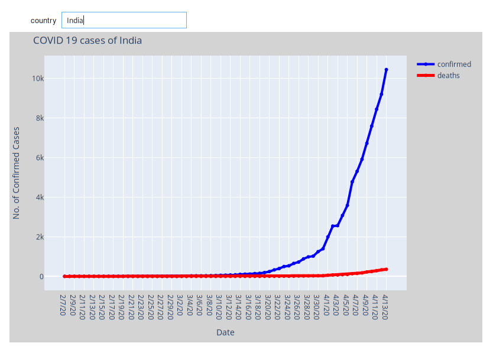

# Introduction

It is for daily status of corona virus in India and In the world. It is web scaraper with take data from online indian [website]( https://www.mohfw.gov.in/) for India and [global](https://www.worldometers.info/coronavirus/) for world. Data is also visulize by graph.
and also data visulization for Corona Daily status data [Ref](https://raw.githubusercontent.com/CSSEGISandData/COVID-19/master/csse_covid_19_data/) and voila dashbord.

## Installation

```
linux : sudo apt-get install python3 python3-pip 
windows install python3 from : https://www.python.org/downloads/
pip3 install jupyter pandas bs4 requests tabulate os sys numpy matplotlib jupyter ipywidgets IPython plotly folium seaborn voila
```

## Usage

### web scrapping Script
```
cd corona
python3 corona_status.py -h
```
### voila dashbord

```
cd corona
jupyter noteboke
voila voila_corona_dashbord.ipynb --port 8888
```



